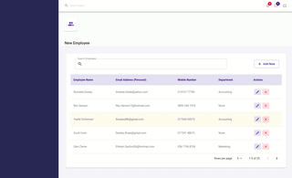
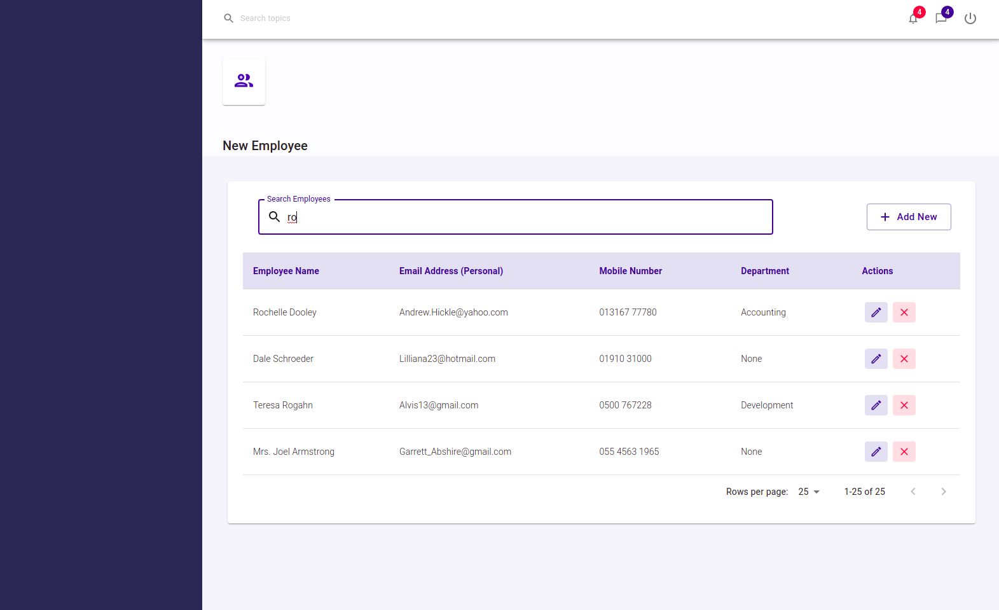
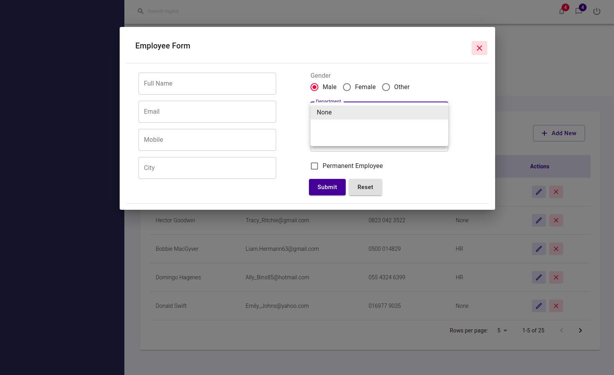
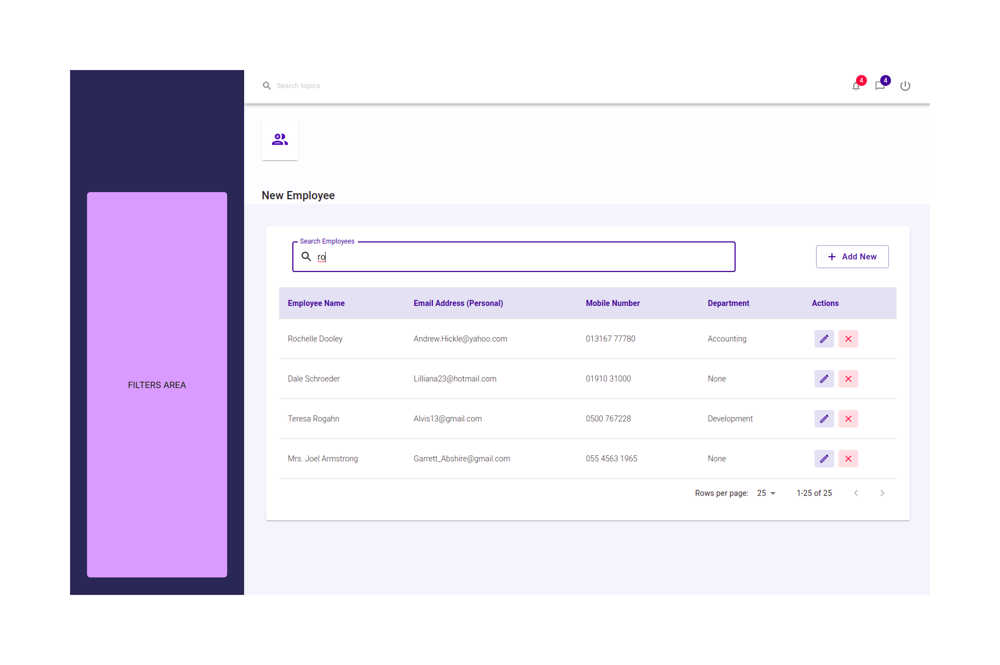
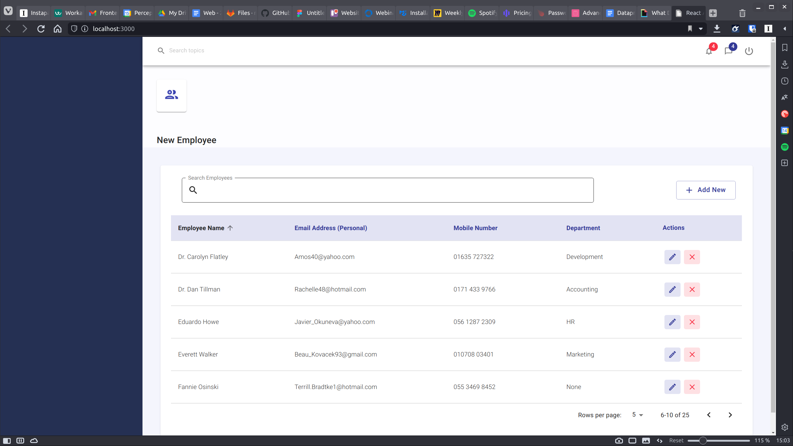

# Welcome

Employee dashboard technical pairing challenge




# Install 

* Run `npm i`
* Run `npm start`

> The data will be seeded at the first runtime

# Background 

The app uses React and Material UI to create the employee dashboard that is in front of you. 

Data is stored in localStorage.

Features: 
* rendering a list of employees
* correctly searching and matching employees
* employee records can be edited 
* employee records can be deleted
* employee records can be added to the list
* pagination rows can be changed
* employee pages can be changed

# Tasks

## Get familiar

Spend some time to familiarise yourself with the code

## Search

Search is broken at the minute - what could be the problem?

If we search with `ro` we search correctly



If we search with `Ro` we no longer search correctly even though there are items that match


## Add / Department dropdown

The department dropdown seems to be broken atm. 

What could be the issue



## Department filter dropdown



Task: add a department filter dropdown

Consider both placement and how we migh connect the UI with the data.

Use the MUI v4 documentation to find a correct component for this task.

User story:

```
Given: a user from marketing wants to only see employees from that department

Then: they select 'Marketing' from a 'Department' dropdown

Then: the employee list is filtered by that department
```

## Bonus task



By default sort the employee list in accending alphabetical order on the `Employee name` column.